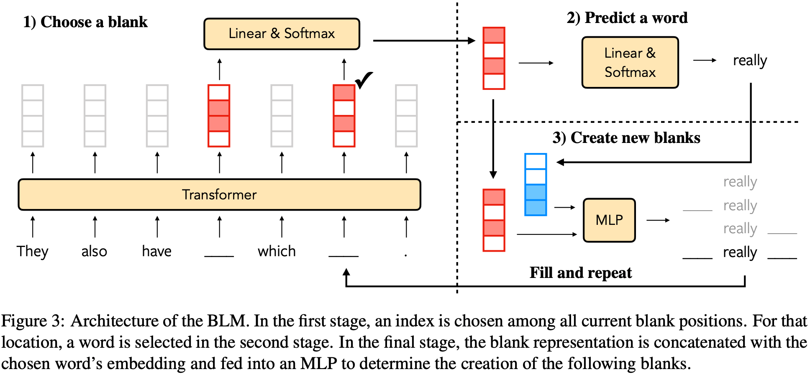

# Blank Language Models

This repository contains the code for our EMNLP 2020 paper:  
[**Blank Language Models**](https://arxiv.org/abs/2002.03079)  
*Tianxiao Shen&ast;, Victor Quach&ast;, Regina Barzilay, and Tommi Jaakkola (&ast;: Equal contribution)*

Given partially specified text with one or more blanks, BLM will fill in the blanks with a variable number of tokens consistent with the context, making it ideal for text editing and rewriting.

Input:  They also have \___ which \___ .  
Output: They also have <u>ice cream</u> which <u>is really good</u> .

<p align="center"></p>

## Demo

Online demo available at [http://128.52.131.173:8501].

Or try locally by running

```
streamlit run app.py
```


## Acknowledgements
We use the Transformer implementation from https://github.com/jadore801120/attention-is-all-you-need-pytorch


## Citation

If you use our work, please cite:

```bibtex
@inproceedings{shen2020blank,
    title = "{Blank Language Models}",
    author = "Shen, Tianxiao  and
      Quach, Victor  and
      Barzilay, Regina  and
      Jaakkola, Tommi",
    booktitle = "Proceedings of the 2020 Conference on Empirical Methods in Natural Language Processing",
    month = nov,
    year = "2020",
    address = "Online",
    publisher = "Association for Computational Linguistics"
}
```
